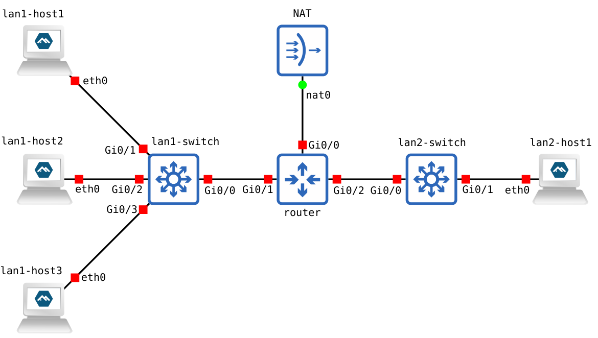

<h3>Исследование механизмов работы и верификация устойчивости протокола ARP к аномальным запросам в среде виртуализации QEMU</h3>
<h4>Используемое ПО:</h4>
Хост: Debian GNU/Linux 12 (bookworm)  
Оркестратор: GNS3 v3.0.5 
Гипервизор: QEMU v7.2.22 + VMM GUI v4.1.0 
Гостевая система: Alpine Linux v3.16 
Инструмент исследования: Scapy v2.5.0, Wireshark v4.0.17, arp 
<h4>Цель работы:</h4> Изучить стандартные и пограничные состояния протокола ARP, используя библиотеку Scapy для генерации произвольных кадров, и проанализировать реакцию сетевого стека гостевых ОС на некорректные параметры. 
<h4>Задачи:</h4>
<li>Развернуть в оркестраторе GNS3 топологию сети, включающую несколько независимых узлов на базе QEMU.
<li>Реализовать стандартные сценарии ARP (Request/Reply, Probe, Announcement) и сопоставить их с требованиями RFC 826 и RFC 5227.
<li>Исследовать механизм Proxy ARP (RFC 1027) при межузловой передаче данных.
<li>Провести серию экспериментов по внедрению аномальных ARP-пакетов (нестандартные коды операций, подмена длин адресов).
<li>Проанализировать уязвимость сетевого стека к ARP Poisoning и зафиксировать изменения в кэше гостевой системы. 
<h4>Топология тестовой сети</h4>

Руководство по созданию простейшей топологии находится в этом же репозитории в папке <a href="../../manuals/GNS3/Setting up a simple topology in GNS3.md">manuals/GNS3.</a>

<h4>Пример формирования Ethernet- кадра с вложенным ARP- пакетом через Scapy</h4>

<code>from scapy.all import * 
packet = Ether(src="aa:aa:aa:aa:aa:aa", dst="ff:ff:ff:ff:ff:ff", type=0x0806) / ARP( 
    hwtype=1, 
    ptype=0x0800, 
    hwlen=6, 
    plen=4, 
    op=1, 
    hwsrc="aa:aa:aa:aa:aa:aa", 
    psrc="192.168.1.100", 
    hwdst="00:00:00:00:00:00", 
    pdst="192.168.1.1" 
) 
sendp(packet, iface="enp3s0")</code> 