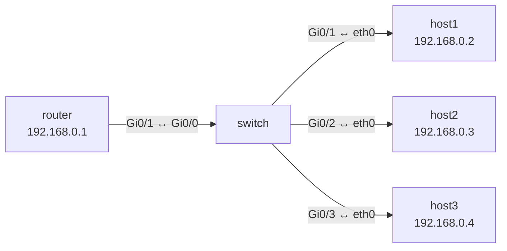

// FIXME: на русский

1. Now we'll create a simple topology with a router, a switch, and three hosts as an example using Cisco IOS. We won't be using VLANs or anything else for now, but we'll just enable DHCP on the router for automatic address leasing.
   We configure the router interface, set up a DHCP server, and assign an address to the router:
   
   `enable`
   `configure terminal`
   `hostname router`

   `interface GigabitEthernet0/1`
   `ip address 192.168.0.1 255.255.255.0`
   `no shutdown`
   `exit`
   
   `ip dhcp excluded-address 192.168.0.1`  
  
   `ip dhcp pool general`  
   `network 192.168.0.0 255.255.255.0`  
   `default-router 192.168.0.1`  
   `dns-server 8.8.8.8`  
   `exit`
   `exit`
   
   `write memory`
   
2. Now let's configure the switch:
   
   `enable`  
   `configure terminal`  

   `interface range GigabitEthernet0/1-3`  
   `switchport mode access`  
   `no shutdown`  
  
   `interface GigabitEthernet0/0`  
   `switchport mode access`  
   `no shutdown`  
   `exit`
   `exit`
   
   `write memory`
   
3. Now let's check the router and switch settings. On the router:
   
   `show ip interface brief`
   `show ip dhcp pool`
   `show ip dhcp binding`
   
   On the switch:
   `show ip interface brief`
   `show mac address-table`
   
4. If the hosts (I'm using Alpine) don't have an IP address, enter:
   
   `udhcpc -i eth0`

Our simplest network is ready to go!
